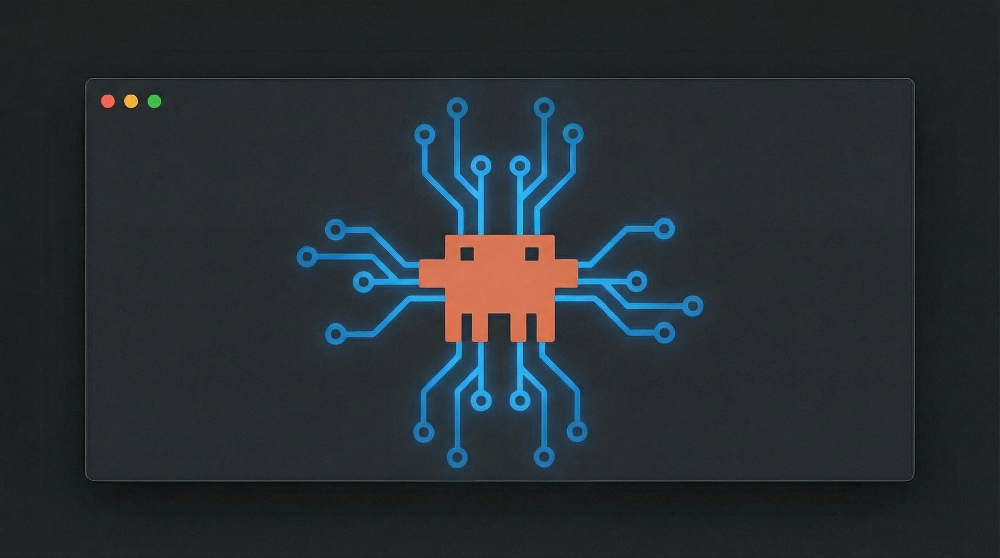

<p align="center">
  
</p>

# LinkedIn Automator

Automated LinkedIn outreach for Claude Code. Build relationships through genuine conversation, not spam.

## What It Does

- **DM Connections** - Send personalized openers to your existing connections
- **Answer DMs** - Reply to unread messages with contextual, on-brand responses
- **Create Posts** - Generate LinkedIn content from proven templates
- **Grow Network** - Send strategic connection requests to ICP matches

## Installation

```bash
npx skills add charlesdove977/linkedin-automator -g
```

**IMPORTANT: After installing, run the setup wizard first:**
```
/linkedinoutreach
```
This creates your personalized config and tracking folders. The other commands won't work until setup is complete.

## Prerequisites

### 1. Claude-in-Chrome Extension

Install the Claude-in-Chrome browser extension to enable browser automation.

### 2. Launch with Chrome

Always start Claude Code with the `--chrome` flag:

```bash
claude --chrome
```

### 3. Verify Connection

The setup wizard will help verify your Chrome connection is working.

## Commands

| Command | Description |
|---------|-------------|
| `/linkedinoutreach` | **Setup wizard** - Configure profile, ICP, voice, schedule |
| `/linkeddmconnections` | **Outreach** - DM existing connections with personalized openers |
| `/linkedanswerdm` | **Replies** - Answer unread DMs with contextual responses |
| `/linkedinpost` | **Content** - Generate posts from templates |
| `/linkedconnect` | **Growth** - Send connection requests to ICP matches |

## Quick Start

### First Time Setup

```
/linkedinoutreach
```

This creates your `linkedin-automator/` folder with:
- Your profile and business info
- ICP targeting criteria
- Communication style preferences
- Activity schedule

### Daily Workflow

1. **Morning** - `/linkedanswerdm` to reply to overnight messages
2. **Midday** - `/linkeddmconnections` to start new conversations
3. **Afternoon** - `/linkedconnect` to grow your network
4. **Weekly** - `/linkedinpost` to stay visible

## How It Works

### Automation Modes

During setup, choose your preferred level of control:

**Human-in-the-loop (Recommended)**
- Review and approve each message before it's sent
- Full control over every interaction
- Best for learning and refining your approach

**Fully Autonomous**
- Messages sent automatically without approval
- Review logs afterward
- Best for high-volume outreach once you've dialed in your voice

### Message Approval Flow (Human Mode)

In human-in-the-loop mode, every message is shown for your approval before sending:

```
┌─────────────────────────────────────────┐
│ To: John Smith - Founder @ TechCorp     │
│                                         │
│ Hey John — saw you're building in the   │
│ AI automation space. How are you        │
│ handling client onboarding these days?  │
│                                         │
│ [Send] [Edit] [Skip]                    │
└─────────────────────────────────────────┘
```

### Prospect Filtering

Connections are evaluated against your ICP:

- **Strong fit** - Matches your target criteria
- **Worth a shot** - Partial match, interesting signal
- **Skip** - Doesn't match (employees, job seekers, etc.)

### Conversation Tracking

All activity is logged in your `linkedin-automator/` folder:

```
linkedin-automator/
├── config.md           # Your profile & preferences
├── outreach/
│   ├── strategy.md     # What's working
│   └── tracking.md     # Sent messages log
├── dms/
│   ├── guidelines.md   # Response patterns
│   └── tracking.md     # Conversation log
├── connections/
│   └── tracking.md     # Connection requests
└── content/
    └── tracking.md     # Posts created
```

## Philosophy

### Warm Outreach, Not Cold Spam

We only message people you're already connected with. This means:
- Higher response rates
- No LinkedIn restrictions
- Genuine relationship building

### Value First

The first message never pitches. It:
- References something specific about them
- Asks a genuine question
- Opens a conversation

### Conversation > Conversion

The goal isn't to book calls. It's to:
- Understand their world
- Share relevant experiences
- Let opportunities emerge naturally

### Your Level of Control

You choose how much oversight you want:
- Find the right people
- Draft personalized messages
- Maintain your voice at scale

## Troubleshooting

### Chrome Not Connected

1. Make sure Claude-in-Chrome extension is installed
2. Launch with `claude --chrome`
3. Run `/linkedinoutreach` to verify connection

### LinkedIn Rate Limits

- Keep DM sessions to 10-20 messages
- Space out connection requests
- The plugin tracks weekly limits for you

### Messages Feel Off

Run `/linkedinoutreach` again to refine your voice settings.

## License

MIT
